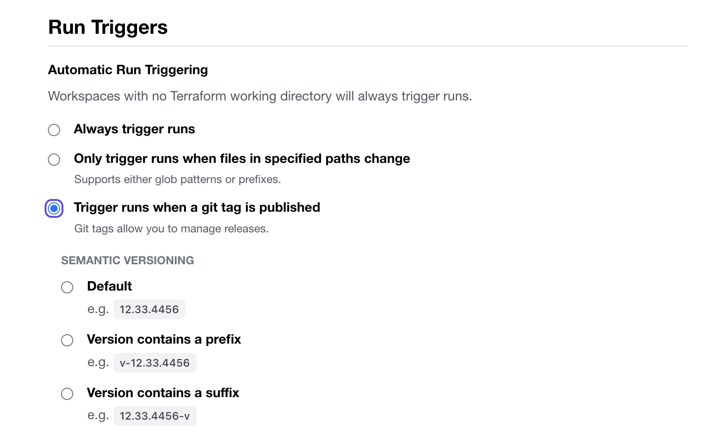

## Git Tags

### Enable `Run Trigger on Git Tags`


### 1) Make and commit code change

### 2) Create and push tag

```
$ git tag v1.0.1
$ git push --tags
```

## Cloud Agents

### ENV variables exports
```
export TFC_AGENT_TOKEN=<token>
export TFC_AGENT_NAME=<agent name>
```
### Launch Agent
```
docker run --env TFC_AGENT_TOKEN=$TFC_AGENT_TOKEN --env TFC_AGENT_NAME=$TFC_AGENT_NAME  hashicorp/tfc-agent:latest
```
